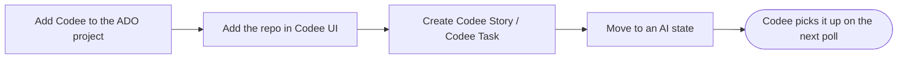

# Starting a new project in Azure DevOps

You already have Codee running and connected to your Azure DevOps organization, and now you
want it to work on a different codebase: a new product, a new service, or a repository it
has never touched. This tutorial covers everything you have to set up before Codee picks
up its first work item there.

It takes three steps:

1. **Give Codee access to the Azure DevOps project**, with the `Codee` work item types and
   the `AI` states available in it.
2. **Add the git repository to Codee**, on the **Repositories** page in the Codee UI.
3. **Create work items and move them into an `AI` state.**

## 1. Add Codee to the Azure DevOps project

Codee does not have a per-project setting. It polls **every project in the organization that
the connected account can read**, so setting up a project comes down to two things:

- **Codee's account is a member.** Add it under **Project settings → Permissions** as a
  **Contributor**, or invite it through **Project settings → Teams**. Contributor is enough:
  it can read work items, change their state, comment, and open pull requests. Membership is
  also what makes the project visible to the poll at all — a project Codee's account cannot
  read is a project Codee never sees.
- **The work item types and states exist.** `Codee Task`, `Codee Story` and the `AI` states
  come from an inherited process. If you already set one up for an earlier project, you do
  not create anything new - open **Project settings → Overview → Process** and point the new
  project at that same process. If this is your first project, follow
  [Creating the work item types](./working-on-tasks-in-azure-devops#creating-the-work-item-types)
  and [Creating states for Codee](./working-on-tasks-in-azure-devops#creating-states-for-codee)
  once, and reuse the result everywhere afterwards.

Nothing needs to be reconfigured in Codee itself. The app registration, the tokens and the
MCP server are per-organization, and they already cover the new project.

## 2. Add the repository to Codee

Codee works on clones it manages itself, under `repositories/` in the Codee project
directory. Until a repository is added there, Codee has no way to work on it.

In the Codee UI, open **Repositories**, paste the clone URL and click **Add repository**.
Codee makes a bare clone in `repositories/<name>/.bare`. Each branch the agents work on
becomes its own worktree, so several tasks can run at once without stepping on each other.

:::tip[SSH is the easier clone URL]

Both URL forms work. HTTPS needs a PAT stored in the git credential helper on the worker
machine, and rotated when it expires; SSH needs one key pair, set up once and never
touched again. If you have no reason to prefer HTTPS, take the SSH URL.
:::

### What the repository needs

| Requirement | Why |
| --- | --- |
| Reachable from the machine the Codee worker runs on | The clone is a plain `git clone`, run as the worker's user: an SSH key on that machine, or a PAT in its git credential helper. |
| Push access | Codee pushes branches and opens pull requests. |

The repository does not have to live in Azure Repos. Azure Repos, GitHub, Bitbucket and
GitLab all work, and one story can span repositories on different hosts, as long as the
worker machine can pull and push each of them.

### Tell the agents what the repository is

Add a brief description of each repository to the Codee project's `AGENTS.md`, so the
agents know which repository is which.

Keep the details out of this file. The stack, the build, test and run commands and the
project conventions belong in the repository's own `AGENTS.md`, `CLAUDE.md` or
`.claude/skills`, versioned with the code.

## 3. Create the work items

Create the work items in Azure DevOps as usual, with two constraints:

- **Type: `Codee Story` or `Codee Task`.** Codee ignores every other work item type.
- **The work is in the description.** Codee reads the description, the acceptance criteria,
  the attachments, the comments and the linked work items. Screenshots, error output, links
  to an existing implementation and a Definition of Done all belong there.

The assignee is not a constraint: the poll does not filter on one, so leave the work item
with whoever owns it.

### Story or task

Use a **`Codee Story`** when the work needs several steps, spans repositories, or is not yet
concrete enough to implement. Codee plans it first and you approve the plan before any code
is written.

Use a **`Codee Task`** when you already know what the change is and it fits in one pull
request. It goes straight to implementation.

## 4. Move it to an `AI` state

The state is the trigger. Type says the work item is one Codee handles at all; the state
says it is Codee's now and what to do with it, and Codee only acts on states its skills
declare.

| Type | Start it in | What Codee does |
| --- | --- | --- |
| `Codee Story` | `AI Decomposition needed` | Reads the story and the code, asks any clarifying questions, creates child work items with acceptance criteria, and moves the story to `AI Decomposition review` for you to approve. |
| `Codee Task` | `AI Ready for development` | Implements the change on its own branch and opens a pull request, then moves the work item on to review. |

From here the work item follows the normal pipeline - development, code review, security
review, QA, then `AI Ready for Human review` where a person merges. That whole flow, state
by state, is in
[Working on tasks in Azure DevOps](./working-on-tasks-in-azure-devops#story-flow).

If nothing gets picked up, work through
[When nothing gets picked up](./working-on-tasks-in-azure-devops#when-nothing-gets-picked-up).
