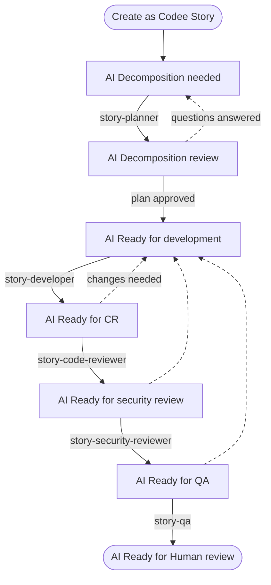
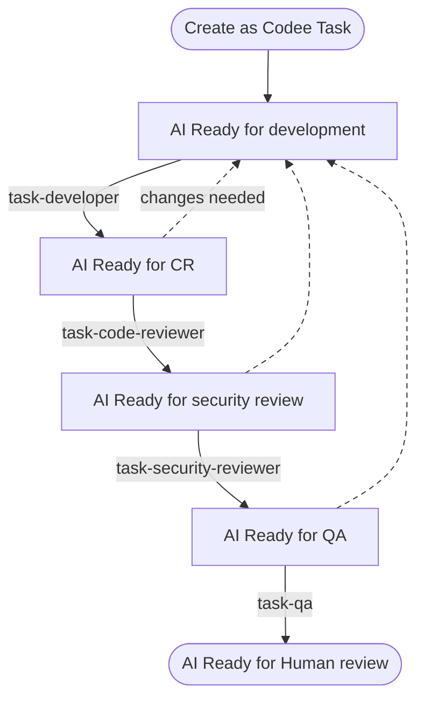

# Working on tasks in Azure DevOps

Codee works in Azure DevOps like a teammate does. It watches your organization for work
items in a state it handles, picks them up, does the work, and moves the work item to the
next state.

To hand a work item to Codee, **set it to an `AI` state**. That is the whole handover — the
`AI` states are what your team and Codee agree mean "this one is the AI's now", which is why
they must be states nothing else in your process uses.

Nothing is filtered on the assignee. A work item reaching an `AI` state is picked up whoever
it is assigned to, so leave it with whoever owns it — you will want it back on them when
Codee hands it to `AI Ready for Human review`.

There is one more requirement, which is what the setup below is mostly about: the work item
has to be of a type you listed under **Settings → Tasks provider → Work items**. Codee
ignores every other type, even in a matching state.

This tutorial uses two custom types, `Codee Story` and `Codee Task`, so that work handed to
Codee is separated from your team's own backlog by type as well as by state. That is a
choice, not a requirement — the mapping ships pointing at `User Story` and `Task`, and you
can leave it there and separate the work by state alone.

:::warning[The `AI` states have to be Codee's alone]

Because state is the only handover, any work item of a mapped type that lands in one of
these states gets worked on. Do not reuse an existing state your team already moves work
items through, and do not add an `AI` state to a type Codee should not be driving.
:::

:::tip[You can still narrow the queue yourself]

**Settings → Tasks provider → Custom WIQL** adds one more `AND` condition to every poll, so
an organization that does want an owner filter — or a tag, or an area path — writes it
there. `[System.AssignedTo] = @Me` restores the assignee filter Codee used to apply on its
own. See [Configuration](../configuration).
:::

This tutorial shows how to set up the account and the app registration, how to create the
work item types and states, and how a story and a task move through them.

## The two identities

Codee uses two separate connections to Azure DevOps, and they can sign in as different
accounts:

- **Reading - the Entra ID app registration.** This is what you set up in
  **Settings → Tasks provider** and finish by clicking **Connect to Azure DevOps**.
  It polls for work items and nothing else: every call it makes is a read. The account you
  sign in with during that consent step does not filter the queue — it decides what the
  query can *see*, because a poll spans every project that account can read.
- **Writing - the Azure DevOps MCP server.** The coding agent reads and updates work items
  through Microsoft's own [`@azure-devops/mcp`](https://www.npmjs.com/package/@azure-devops/mcp)
  server, which Codee wires up with `--authentication azcli`. It signs in through the
  **Azure CLI on the machine the agent runs on**, so every comment Codee posts and every
  state change it makes is attributed to whoever ran `az login` there.

:::warning[Use the same account for both]

Sign in as Codee's account during the OAuth consent step **and** run `az login` as Codee's
account on the agent machine. If they differ, work items are read as one identity and
updated as another, which makes the history unreadable and can leave Codee unable to
transition a work item it can see.
:::

### Set up the Codee account

Create a separate Entra ID user for Codee instead of reusing a person's account:

- Its comments, state changes and pull requests are attributed to it, so you can see what
  the AI did and what a person did.
- It is the account whose project access decides what a poll can see, so its membership is
  how you keep Codee out of projects it has no business in.

Its identity has no effect on *which* work items are picked up — the poll does not filter on
an assignee — so this account needs permission to *act* in a project and to read it, not to
be assigned work in it.

1. Pick an email address for Codee, for example `codee@yourcompany.com`, in the Entra ID
   directory that backs your Azure DevOps organization.
2. Add it to the organization: **Organization settings → Users → Add users**. Give it the
   **Basic** access level.
3. Add it to every project it should work in, as a member of the **Contributors** group.
   Contributors can change a work item's state, comment, and create pull requests, which is
   the whole set of things Codee does.
4. On the agent machine, sign the Azure CLI in as that account: `az login`. This is the
   identity behind everything Codee writes.

Then use **Verify connection** on the settings page to check the account can reach your
projects and act on a work item in them.

## Creating the work item types

### Which types Codee polls

Codee picks up the work item types listed under **Settings → Tasks provider → Work items**,
and each maps to an issue type your skills trigger on. The rest of this tutorial assumes
the two custom types it creates below:

| Work item type | `x-codee-issue-type` |
| --- | --- |
| `Codee Story` | `story` |
| `Codee Task` | `task` |

Set that mapping in Settings once the types exist: click **Load types from provider** and
pick `Codee Story` for `story` and `Codee Task` for `task`. Until you do, Codee is still
polling for the default `User Story` and `Task`.

Every other type is ignored, whatever state it is in. The children of a `Codee Story` are
not picked up on their own either. Codee works on them inside the story's run.

### Create work item types in an inherited process

Custom types need an inherited process in Azure DevOps, created once for the organization
and applied to every project Codee works in.

1. **Organization settings → Boards → Process**. Open the `…` menu on the process your
   projects use and choose **Create inherited process**.
2. In the new process, use **New work item type** to add `Codee Task` and `Codee Story`.
3. Add the **Priority** field to both if it is missing; it orders Codee's queue.
4. Point each project at the new process under **Projects → Change process**.

### Set the backlog levels

Backlog levels decide what can be a child of what. In the process, open **Backlog levels**,
add `Codee Story` to the requirement backlog and `Codee Task` to the iteration backlog.
Until you do, a `Codee Task` cannot be given a `Codee Story` parent.

## Creating states for Codee

### Why separate states

Type says the work item is one Codee handles at all. State is the only thing that says the
work item is Codee's now, and what Codee should do with it.

Codee polls for work items whose `System.State` matches a skill's `x-codee-issue-status`
trigger. The `AI` prefix keeps Codee's stages visible on the board.

### Which states to create

:::tip[These states come from the default skills]

The states below, and what each one does, are just what the default skills trigger on.
Nothing here is fixed. You can create different states, have them run different work, and
wire different transitions between them. Codee is fully customizable here.
:::

Create these eight states on **both** `Codee Task` and `Codee Story`, in the process
editor: open the type, go to **States**, and use **New state** for each one. Every state
you add must be put in a **state category** - that is what tells Azure DevOps whether a
work item counts as open, active or closed for boards, queries and burndown.

The `Assignee` column says who acts next. It is a convention for your board, not something
Codee reads — the state alone decides what it picks up.

| State | State category | Who moves it in | Assignee | What happens next |
| --- | --- | --- | --- | --- |
| `AI Decomposition needed` | Proposed | Human (product owner / lead) | Codee | Codee plans the story and creates child work items |
| `AI Decomposition review` | Proposed | Codee | Codee | Human reads the plan, answers questions, approves |
| `AI Ready for development` | Proposed | Human | Codee | Codee implements and opens a pull request |
| `AI In Progress` | In Progress | Codee | Codee | Codee keeps working on the story |
| `AI Ready for CR` | In Progress | Codee | Codee | Codee reviews the pull request |
| `AI Ready for security review` | In Progress | Codee | Codee | Codee runs a security review |
| `AI Ready for QA` | Resolved | Codee | Codee | Codee checks it against the acceptance criteria |
| `AI Ready for Human review` | Resolved | Codee | Codee, until a person takes it | Human does the final check and merges |

Keep at least one `Completed` state (the stock `Closed` or `Done`) and the `Removed`
category state on each type. Codee's own connection check closes the work item it creates,
and a type with nothing in the `Completed` category gives it nowhere to put it.

#### `AI Decomposition needed`

The entry point for a story. A story usually arrives as a description of intent, not as
work you can implement. This state tells Codee to read the story, the linked work items,
the attachments and the code, and turn it into an ordered list of child work items with
acceptance criteria.

**Why it is needed:** this is the state that starts decomposition. While you are still
writing the story, it sits in a normal state and Codee ignores it. Moving it here is you
saying the story is ready to be planned.

#### `AI Decomposition review`

Where Codee leaves the story after planning, and where it leaves the story when it needs an
answer from you.

**Why it is needed:** a plan is the cheapest thing to fix. Fixing a wrong breakdown here
costs one comment. Fixing it after the code is written costs a rewrite. This state is also
where clarifying questions land, see [Clarifying questions](#2-clarifying-questions).

#### `AI Ready for development`

Where Codee starts writing code. For a story this is your approval of the plan, and it
means the child work items are right. Codee then takes one open child per run and
implements it, pushing to one pull request per repository for the whole story, so later
children add commits to the pull request the first one opened. A `Codee Task` with no
parent is implemented directly, with no decomposition. The review and QA states below work
the same way, one child at a time.

**Why it is needed:** Codee does not start writing code until a person moves the work item
here. From there it runs on its own until everything is implemented and the pull requests
are open.

#### `AI In Progress`

Where a work item sits while Codee is working on it. The developer skills trigger on this
state as well as on `AI Ready for development`, so a work item left here is picked up again
and the work continues.

**Why it is needed:** it separates a work item Codee has started from one still waiting in
the queue.

#### `AI Ready for CR`

The pull request exists and needs review. Codee performs a code review on it and posts line
comments and a verdict. If the change needs work, it moves the work item back to
`AI Ready for development`.

**Why it is needed:** the session that wrote the code is a bad judge of it, because it
already thinks the code is correct. A separate state means a separate run, with a different
skill and fresh context, which finds things the first run missed.

:::tip[Use a different model for review]

Run the review on a different model than the one that wrote the code, so it does not carry
the same bias.
:::

#### `AI Ready for security review`

A second review pass, this time security focused. As with code review, anything that needs
fixing sends the work item back to `AI Ready for development`.

**Why it is needed:** in a general code review, security findings compete with naming, tests
and performance, and usually lose. Its own state means every change gets a security pass.

:::tip[Use an open weight model for security review]

An open weight model such as GLM works best here. Claude and GPT have safeguards that make
them worse at this.
:::

#### `AI Ready for QA`

Checking that the feature actually works in a real environment, not re-reading the diff.
Codee maps each acceptance criterion to a test scenario, runs the scenarios, and records
evidence: screenshots for UI, requests and response codes for services. Failures send the
work item back to `AI Ready for development`.

**Why it is needed:** code review answers "is this code good?". QA answers "does it do what
the work item asked for?". These are different questions, and code review often passes
changes that fail the second one.

#### `AI Ready for Human review`

The last state of the automated pipeline. Everything is implemented, reviewed,
security-checked and tested, and now a person makes the final call and merges.

If you want changes instead, comment on the pull request and move the work item back to
`AI Ready for development`. Codee reads the new comments on its next run and addresses them.

Reassign the work item to yourself when you pick it up, so the board shows who owns it. What
takes it out of Codee's queue is moving it out of the `AI` states, not the reassignment.

**Why it is needed:** Codee does not merge its own pull requests. This state is where
finished work waits for a person, so it does not sit unnoticed in a review queue and does
not get merged without someone signing off.

### Wire the states to skills

The state name in Azure DevOps has to match the skill's `x-codee-issue-status` trigger.
The match ignores case:

```yaml
name: story-developer
description: Implement one subtask from an Issue Tracker story and submit a pull request.
disable-model-invocation: true
x-codee-trigger: issue
x-codee-issue-status: ['AI Ready for development', 'AI In Progress']
x-codee-issue-type: story
argument-hint: <STORY_ID>
```

`x-codee-issue-type` picks the issue type the skill applies to, using the mapping above, so
the two types can share state names and still run different skills. Where the skill moves
the work item next is written in the skill body, for example:

```markdown
Make sure the story is in `AI In Progress` before doing any work.
After the change is complete, move it to `AI Ready for CR`.
```

The Codee UI draws these triggers and transitions as a workflow graph, which is the fastest
way to spot a state that nothing leads into.

## Connecting Codee to Azure DevOps

### Register the Entra ID app

Codee needs an Entra ID app registration. **Settings → Tasks provider → Azure DevOps**
walks you through creating one, with the exact redirect URI to copy into it.

### Fill in the settings

| Field | What it is |
| --- | --- |
| Organization URL | `https://dev.azure.com/your-org`, or the legacy `https://your-org.visualstudio.com`. Both forms work. |
| Application (client) ID | From the app registration Overview. |
| Client secret | The secret **Value** from the app registration. |
| Directory (tenant) ID | Optional. Leave empty to sign in against any work or school directory you belong to. |

Then click **Connect to Azure DevOps**, sign in **as Codee's account**, and consent. Codee
stores the access and refresh tokens and renews them on its own; the settings page shows
which account is connected and when the current token expires.

:::note[Codee's connection is not scoped to a specific project]

Codee polls every project in the organization the connected account can read. To limit
that, give the account access only to the projects Codee should work in.
:::

### Set up the MCP server

**Setup MCP Server** writes `.mcp.json` so the coding agent can read and update work items
itself:

```json
{
  "mcpServers": {
    "ado": {
      "command": "npx",
      "args": ["-y", "@azure-devops/mcp", "your-org", "--authentication", "azcli"]
    }
  }
}
```

Two things have to be true on the machine the coding agent runs on, and neither can be
expressed in that file:

- **Node.js is installed**, because the server runs through `npx`.
- **The Azure CLI is signed in** (`az login`), because that is the account the server acts
  as. Without it the server does not start, and Codee can read work items but never move
  them.

### Verify the connection

**Verify connection** pulls work items exactly the way Codee does when it polls: same
account, same types, same states your issue-triggered skills declare, and the same custom
WIQL if you set one. It reports either the work items it found or the reason Azure DevOps
refused.

The MCP check goes further and exercises the write path: it asks the agent to create a
`Codee Task` in any project it can write to, and then move it to a `Done`, `Closed` or
`Removed` state so it does not stay open.

## Story flow

A story is work too large to do in one go. Codee decomposes it into child work items first,
then implements them one by one.

The whole flow is driven by the **story** work item: it is of type `Codee Story`, and its
state is what triggers each run. The children are worked on inside
those runs, and Codee moves their states itself to track where each one is. Because their
parent is a `Codee Story`, Codee skips them in the queue instead of treating each as
separate work.



### 1. Decomposition

Create the story as a `Codee Story` and move it to `AI Decomposition needed`. On the next poll Codee:

1. Reads the story, its acceptance criteria, attachments, comments and linked work items,
   then the project instructions and the code the story touches.
2. Asks clarifying questions in a comment when a requirement is unclear or missing, instead
   of guessing.
3. Creates the child `Codee Task` work items, each with a technical description, acceptance
   criteria and its dependencies.
4. Writes the spec to `story-spec/{STORY_ID}/README.md`, pushes it to Codee's repository,
   and comments with the plan.
5. Moves the story to `AI Decomposition review`.

### 2. Clarifying questions

If the requirements, constraints or expected behavior are unclear, Codee does **not** guess.
It posts the questions as a work item comment, leaves the story in
`AI Decomposition review`, and stops.

To answer, reply in a comment and move the story back to `AI Decomposition needed`. Codee
re-reads the whole comment thread on the next run. Only the state change restarts it, so
remember to move the story after you comment.

This is also how you ask for plan changes. On a second round Codee edits the existing
children and spec instead of starting over, and only creates work items for work that is
actually new, so you can iterate without ending up with duplicates.

When the plan is right, move the story to `AI Ready for development`.

### 3. Development

Codee picks up the story in `AI Ready for development` and works **one** of its open
children per run. For that child it:

- Reads the story, the child work item, `story-spec/{STORY_ID}/README.md` and the project
  instructions.
- Inspects the branches and pull requests that already exist for that child, including any
  unresolved review comments, and addresses the feedback.
- For bugs, reproduces the problem and finds the root cause before editing anything.
- Creates a dedicated worktree and branch.
- Pushes to the story's pull request for that repository, opening it if this is the first
  child to touch the repo, and does **not** merge it.
- Comments on the work item with the change.

Codee then runs again for the next open child. There is one pull request per repository: the
next child in the same repository adds commits to it, and a child in a different repository
gets its own.

This is also how change requests are handled after review: Codee re-reads the feedback and
folds it into the same pull request. See [Human review](#5-human-review).

### 4. Review, security review and QA

Each review stage is its own run, with its own skill and fresh context:

- **`AI Ready for CR`**: correctness, requirement coverage, performance, tests, error
  handling, maintainability. Codee posts line comments for specific problems, plus a verdict
  that leads with the findings, straight into your code management system.
- **`AI Ready for security review`**: the security pass described above.
- **`AI Ready for QA`**: checking against the acceptance criteria, with evidence. Codee runs
  the real application, or uses the deployed app if your environment supports deploying
  branches (considering you provided instructions how to access the running app in the
  skills).

Any stage that finds a blocking problem sends the work item back to
`AI Ready for development` with a report you can act on: what it saw, what it expected, and
where. Unrelated problems Codee finds along the way become their own work items instead of
growing the current one.

When all three passes are clean, the work item lands in `AI Ready for Human review`.

### 5. Human review

Read the pull request, the review comments and the QA evidence, then merge. Moving the work
item out of the `AI` states is what takes it out of Codee's queue; reassigning it to
yourself is how the board shows who owns it now.

The pull request is reviewed where the code lives, which does not have to be Azure DevOps.
The code can sit in any Git host: Azure Repos, GitHub, Bitbucket, GitLab. One story can even
span repositories on different hosts, as long as the machine the Codee worker runs on has
pull and push access to each of them.

#### Requesting changes

Leave the pull request unmerged. Comment on it, or on the child work item itself, then move
both the story and that child back to `AI Ready for development`. Codee reads both places on
its next poll and works the feedback into the same pull request.

:::warning[Move the story to the stage you want run]

The story's state picks the stage, and Codee needs at least one child sitting in that state
to work on. With one child in `AI Ready for development` and the rest in `AI Ready for QA`,
move the story to `AI Ready for development` to get that one implemented.

You can also do it like this: create a new child, put it in `AI Ready for QA`, move the story there, and
Codee runs QA on it.

If nothing sits in the state you moved the story to, Codee has no
child to work on and just moves the story on to the next stage.
:::

## Task flow

A task is standalone work that does not need decomposition: a bug fix, a small change, a
chore. It is a `Codee Task` with no parent, and it skips planning:



Create it as a `Codee Task` and move it straight to `AI Ready for development`. There is no planning round. Codee implements it the same way it
implements a story child: dedicated branch, pull request, work item comment. The review,
security and QA stages work the same as in the story flow.

### Choosing between a story and a task

Use a **`Codee Story`** when the work needs several children, touches more than one part of
the system or more than one repository, or when the requirements are not concrete enough to
implement yet. The decomposition step splits the work up and surfaces the unclear parts
before any code is written.

Use a **`Codee Task`** when you already know what the change is and it fits in one pull
request. Decomposition would only add an extra review step here.

## When nothing gets picked up

Work through these in order - they follow the query Codee actually runs:

1. **Is the type right?** Only `Codee Task` and `Codee Story` are polled. A `User Story`,
   `Product Backlog Item` or `Bug` is invisible to Codee, whatever its state.
2. **Does the state name match a skill exactly?** Case does not matter; everything else
   does. `AI Ready for dev` is not `AI Ready for development`.
3. **Does a skill cover this type *and* this state?** A skill has to match both. A state
   defined on `Codee Task` with only a `story` skill triggering on it never fires.
4. **Does the connected account have access to that project?** The query spans the
   organization, but only the projects that account can read.
5. **Is a custom WIQL filtering it out?** Anything in
   **Settings → Tasks provider → Custom WIQL** is `AND`ed onto every poll and can only
   narrow it. Empty it to rule it out.
6. **Is it a child of a `Codee Story`?** Then it is deliberately skipped - its parent's run
   drives it.

Note that the assignee is *not* on this list: it is not part of the query at all.
