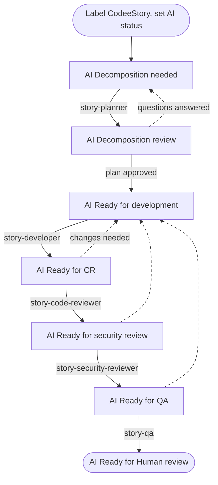
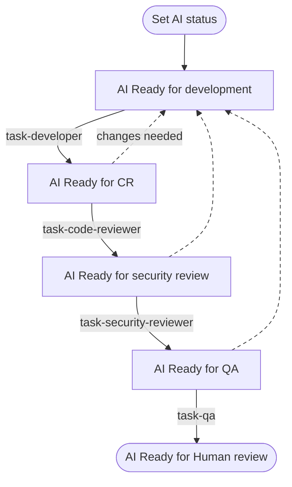

# Working on tasks in Jira

Codee works in Jira like a teammate does. It watches your project for issues in a status
it handles, picks them up, does the work, and moves the issue to the next status.

To hand an issue to Codee, **set it to an `AI` status**. That is the whole handover — the
`AI` statuses are what your team and Codee agree mean "this one is the AI's now", which is
why they must be statuses nothing else in your workflow uses.

For a story, also add the `CodeeStory` label, which tells Codee to drive the whole story
and its subtasks from the story issue.

This tutorial shows how to create those statuses and how a story and a task move through
them.

## Which issues Codee picks up

Codee polls the project you set under **Settings → Tasks provider → Project key** (see
[Configuration](../configuration)) for issues that are of one of the types listed under
**Settings → Tasks provider → Work items** and in one of the statuses its skills trigger
on. That mapping ships pointing `story` at Jira's `Story` and `task` at `Task`; repoint it
there if your project calls them something else.

Nothing is filtered on the assignee. An issue reaching an `AI` status is picked up whoever
it is assigned to, so leave it with whoever owns it — you will want it back on them when
Codee hands it to `AI Ready for Human review`.

If you do want the queue narrowed further, **Settings → Tasks provider → Custom JQL** adds
one more `AND` condition to every poll — an assignee, a label, a component. See
[Configuration](../configuration).

:::warning[The `AI` statuses have to be Codee's alone]

Because status is the only handover, any issue of a mapped type that lands in one of these
statuses gets worked on. Do not reuse an existing status your team already moves issues
through, and do not add an `AI` status to a workflow Codee should not be driving.
:::

:::tip[Label the story `CodeeStory`]

Add the `CodeeStory` label to a story you hand to Codee. Codee then runs the whole story
from the story issue itself and manages the subtasks inside that run, moving their statuses
itself to keep track of where each one is. You do not need to assign them or move them
along.

The label also stops Codee from picking the subtasks up separately. Without it, any
subtask that sits in a matching status is treated as its own piece of work.
:::

Stories and tasks share one queue, ordered by priority first and then oldest. So the Jira
**Priority** field controls what Codee works on next: raise the priority of an issue and
Codee takes it before the others waiting.

### Set up the Codee account

Codee authenticates as a Jira user, and every comment, status change and pull request it
makes is attributed to that user. Create a separate one for it rather than reusing a
person's account, so a glance at an issue's history tells you what the AI did and what a
person did. Its email and API token are what you paste into
**Settings → Tasks provider**.

Its identity has no effect on what gets picked up — the poll does not filter on an
assignee — so this account needs permission to *act* in the project, not to be assigned
work in it.

On Jira Cloud:

1. Pick an email address for Codee, for example `codee@yourcompany.com`. It has to be a
   real mailbox you can receive the invite at.
2. Open the Atlassian admin console at [admin.atlassian.com](https://admin.atlassian.com),
   go to your organization, then **Directory → Users → Invite users**. Enter the email and
   give it access to Jira.
3. Accept the invite from that mailbox and finish creating the account.
4. Add the account to your project. In a company-managed project that is
   **Project settings → People → Add people**, in a team-managed project
   **Project settings → Access → Add people**.
5. Give it a role that includes the **Transition Issues**, **Add Comments** and
   **Edit Issues** permissions. Company-managed projects list these under
   **Project settings → Permissions**. **Assignable User** is worth adding too, so a
   person can hand an issue to it by name, but Codee does not need it to work.
6. Log in as Codee and create an API token at
   [id.atlassian.com/manage-profile/security/api-tokens](https://id.atlassian.com/manage-profile/security/api-tokens),
   using **Create API token**. This is the token you paste into
   **Settings → Tasks provider → API token**, alongside the same email under
   **API Token Owner Email**.

Then use **Verify connection** on the settings page to check the account can reach the
project and act on an issue in it.

## Creating statuses for Codee in Jira

### Why separate statuses

Status is the only thing that says an issue is Codee's, and what Codee should do with it
now.

Codee polls Jira for issues whose status matches a skill's `x-codee-issue-status` trigger.
The `AI` statuses exist so that anyone looking at the board can see at a glance which
stories and tasks are in the AI workflow that Codee runs, and which stage of it they are
at.

### Which statuses to create

:::tip[These statuses come from the default skills]

The statuses below, and what each one does, are just what the default skills trigger on.
Nothing here is fixed. You can create different statuses, have them run different work,
and wire different transitions between them. Codee is fully customizable here.
:::

Create these eight statuses. The `AI` prefix keeps them together in lists and makes it
clear on the board who owns the issue.

The `Assignee` column says who acts next. It is a convention for your board, not
something Codee reads — the status alone decides what it picks up.

| Status | Who moves the issue in | Assignee | What happens next |
| --- | --- | --- | --- |
| `AI Decomposition needed` | Human (product owner / lead) | Codee | Codee plans the story and creates subtasks |
| `AI Decomposition review` | Codee | Codee | Human reads the plan, answers questions, approves |
| `AI Ready for development` | Human | Codee | Codee implements and opens a pull request |
| `AI In Progress` | Codee | Codee | Codee keeps working on the story |
| `AI Ready for CR` | Codee | Codee | Codee reviews the pull request |
| `AI Ready for security review` | Codee | Codee | Codee runs a security review |
| `AI Ready for QA` | Codee | Codee | Codee checks it against the acceptance criteria |
| `AI Ready for Human review` | Codee | Codee, until a person takes it | Human does the final check and merges |

#### `AI Decomposition needed`

The entry point for a story. A story usually arrives as a description of intent, not as
work you can implement. This status tells Codee to read the story, the linked issues, the
attachments and the code, and turn it into an ordered list of subtasks with acceptance
criteria.

**Why it is needed:** this is the status that starts decomposition. While you are still
writing the story, it sits in a normal status and Codee ignores it. Moving it here is you
saying the story is ready to be planned.

#### `AI Decomposition review`

Where Codee leaves the story after planning, and where it leaves the story when it needs
an answer from you.

**Why it is needed:** a plan is the cheapest thing to fix. Fixing a wrong breakdown here
costs one comment. Fixing it after the code is written costs a rewrite. This status is
also where clarifying questions land, see
[Clarifying questions](#2-clarifying-questions).

#### `AI Ready for development`

Where Codee starts writing code. For a story this is your approval of the plan, and it
means the subtasks are right. Codee then takes one open subtask per run and implements it,
pushing to one pull request per repository for the whole story, so later subtasks add
commits to the pull request the first one opened. A task is implemented directly, with no
subtasks. The review and QA statuses below work the same way, one subtask at a time.

**Why it is needed:** Codee does not start writing code until a person moves the work item
here. From there it runs on its own until everything is implemented and the pull requests
are open.

#### `AI In Progress`

Where a work item sits while Codee is working on it. The developer skills trigger on this
status as well as on `AI Ready for development`, so a work item left here is picked up
again and the work continues.

**Why it is needed:** it separates a work item Codee has started from one still waiting in
the queue.

#### `AI Ready for CR`

The pull request exists and needs review. Codee performs a code review on it and posts
line comments and a verdict. If the change needs work, it moves the issue back to
`AI Ready for development`.

**Why it is needed:** the session that wrote the code is a bad judge of it, because it
already thinks the code is correct. A separate status means a separate run, with a
different skill and fresh context, which finds things the first run missed.

:::tip[Use a different model for review]

Run the review on a different model than the one that wrote the code, so it does not carry
the same bias.
:::

#### `AI Ready for security review`

A second review pass, this time security focused. As with code review, anything that needs
fixing sends the issue back to `AI Ready for development`.

**Why it is needed:** in a general code review, security findings compete with naming,
tests and performance, and usually lose. Its own status means every change gets a security
pass.

:::tip[Use an open weight model for security review]

An open weight model such as GLM works best here. Claude and GPT have safeguards that make
them worse at this.
:::

#### `AI Ready for QA`

Checking that the feature actually works in a real environment, not re-reading the diff.
Codee maps each acceptance criterion to a test scenario, runs the scenarios, and records
evidence: screenshots for UI, requests and response codes for services. Failures send the
issue back to `AI Ready for development`.

**Why it is needed:** code review answers "is this code good?". QA answers "does it do
what the work item asked for?". These are different questions, and code review often
passes changes that fail the second one.

#### `AI Ready for Human review`

The last status of the automated pipeline. Everything is implemented, reviewed,
security-checked and tested, and now a person makes the final call and merges.

Reassign the issue to yourself when you pick it up, so the board shows who owns it. What
takes it out of Codee's queue is leaving this status, which no skill triggers on.

**Why it is needed:** Codee does not merge its own pull requests. This status is where
finished work waits for a person, so it does not sit unnoticed in a review queue and does
not get merged without someone signing off.

### Add the transitions

Jira only lets an issue move along transitions that exist in the workflow, so make sure
every transition Codee needs is there. For example `AI Ready for development` →
`AI In Progress`, and `AI In Progress` → `AI Ready for CR`. Reviews fail, so the
review statuses also need a way back to `AI Ready for development`.

The simplest option is to let any status reach any `AI` status. In the workflow editor
that is the "Allow all statuses to transition to this one" checkbox on each `AI` status.

### Wire the statuses to skills

The status name in Jira has to match the skill's `x-codee-issue-status` trigger **exactly**:

```yaml
name: story-developer
description: Implement one subtask from an Issue Tracker story and submit a pull request.
disable-model-invocation: true
x-codee-trigger: issue
x-codee-issue-status: ['AI Ready for development', 'AI In Progress']
x-codee-issue-type: story
argument-hint: <STORY_ID>
```

`x-codee-issue-type` picks the issue type the skill applies to, so `story` and `task` can
share status names and still run different skills. Where the skill moves the issue next is
written in the skill body, for example:

```markdown
Make sure the story is in `AI In Progress` before doing any work.
After the change is complete, move it to `AI Ready for CR`.
```

The Codee UI draws these triggers and transitions as a workflow graph, which is the
fastest way to spot a status that nothing leads into.

## Story flow

A story is work too large to do in one go. Codee decomposes it into subtasks first, then
implements them one by one.

The whole flow is driven by the **story** issue: it stays labelled `CodeeStory`, and its
status is what triggers each run. The subtasks are worked on inside
those runs, and Codee moves their statuses itself to track where each one is.



### 1. Decomposition

Add the `CodeeStory` label to the story and move it to
`AI Decomposition needed`. Codee picks it up on the next poll and:

1. Reads the story, its acceptance criteria, attachments, comments and linked issues.
2. Reads the project instructions (`CLAUDE.md`, `AGENTS.md`, local skills) and the code the
   story touches, so the plan matches how the system works today.
3. Builds an ordered list of small subtasks that can be implemented one at a time. Each one
   gets a title, a technical description, acceptance criteria and its dependencies.
4. Creates those subtasks in Jira under the story.
5. Writes the spec to `story-spec/{STORY_ID}/README.md` in the repository, plus
   `architecture.md` when the data flow needs explaining.
6. Posts a Jira comment with the plan, linking the subtasks and the spec.
7. Moves the story to `AI Decomposition review`.

A good story states the outcome and the constraints. Codee reads the code to work out the
*how*. If a requirement is unclear or missing, it asks instead of guessing.

### 2. Clarifying questions

If the requirements, constraints or expected behavior are unclear, Codee does **not**
guess. It posts the questions as a Jira comment, leaves the story in
`AI Decomposition review`, and stops.

To answer, reply in a Jira comment and move the story back to
`AI Decomposition needed`. Codee re-reads the whole comment thread on the next run. Only
the status change restarts it, so remember to move the story after you comment.

This is also how you ask for plan changes. On a second round Codee edits the existing
subtasks and spec instead of starting over, and only creates subtasks for work that is
actually new, so you can iterate without ending up with duplicates.

When the plan is right, move the story to `AI Ready for development`.

### 3. Development

Codee picks up the story in `AI Ready for development` and works **one** of its open
subtasks per run. For that subtask it:

- Reads the story, the subtask, `story-spec/{STORY_ID}/README.md` and the project
  instructions.
- For bugs, reproduces the problem and finds the root cause before editing anything.
- Creates a dedicated worktree and branch.
- Pushes to the story's pull request for that repository, opening it if this is the first
  subtask to touch the repo, and does **not** merge it.
- Comments on the Jira issue with the change.

Codee then runs again for the next open subtask. There is one pull request per repository:
the next subtask in the same repository adds commits to it, and a subtask in a different
repository gets its own.

### 4. Review, security review and QA

Each review stage is its own run, with its own skill and fresh context:

- **`AI Ready for CR`**: correctness, requirement coverage, performance, tests, error
  handling, maintainability. Codee posts line comments for specific problems, plus a
  verdict that leads with the findings, straight into your code management system
  (GitHub, GitLab, Azure DevOps).
- **`AI Ready for security review`**: the security pass described above.
- **`AI Ready for QA`**: checking against the acceptance criteria, with evidence. Codee
  runs the real application, or uses the deployed app if your environment supports
  deploying branches (considering you provided instructions how to access the running app
  in the skills).

Any stage that finds a blocking problem sends the issue back to
`AI Ready for development` with a report you can act on: what it saw, what it expected,
and where. Unrelated problems Codee finds along the way become their own Jira issues
instead of growing the current one.

When all three passes are clean, the issue lands in `AI Ready for Human review`.

### 5. Human review

Read the pull request, the review comments and the QA evidence, then merge. Reassign the
issue to yourself when you pick it up so the board shows who owns it, and move it out of
`AI Ready for Human review` — leaving that status is what ends Codee's involvement.

## Task flow

A task is standalone work that does not need decomposition: a bug fix, a small change, a
chore. It skips planning:



Move the task straight to `AI Ready for development`. There is no planning round. Codee implements it the same way it implements a story subtask: dedicated
branch, pull request, Jira comment. The review, security and QA stages work the same as in
the story flow.

### Choosing between a story and a task

Use a **story** when the work needs several subtasks, touches more than one part of the
system or more than one repository, or when the requirements are not concrete enough to
implement yet. The decomposition step splits the work up and surfaces the unclear parts
before any code is written.

Use a **task** when you already know what the change is and it fits in one pull request.
Decomposition would only add an extra review step here.
